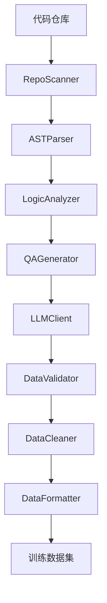
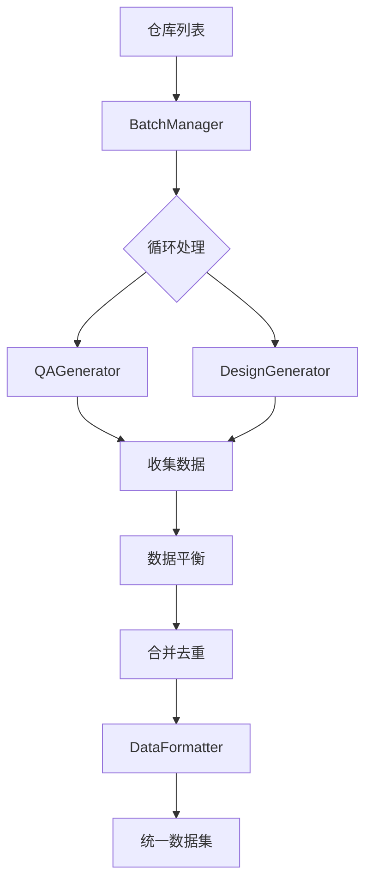

# 系统架构设计

本文档详细介绍智能训练数据生成系统的架构设计。

## 架构概述

系统采用分层架构设计，主要包含以下层次：

```
┌─────────────────────────────────────────────────────────────────┐
│                         输入层                                   │
│  ┌─────────────────┐  ┌─────────────────┐                       │
│  │   本地代码仓库   │  │    配置文件      │                       │
│  └────────┬────────┘  └────────┬────────┘                       │
└───────────┼────────────────────┼────────────────────────────────┘
            │                    │
            ▼                    ▼
┌─────────────────────────────────────────────────────────────────┐
│                       代码解析层                                 │
│  ┌─────────────┐  ┌─────────────┐  ┌─────────────┐              │
│  │  仓库扫描器  │  │  AST解析器  │  │  文档提取器  │              │
│  └──────┬──────┘  └──────┬──────┘  └──────┬──────┘              │
└─────────┼────────────────┼────────────────┼─────────────────────┘
          │                │                │
          ▼                ▼                ▼
┌─────────────────────────────────────────────────────────────────┐
│                       代码分析层                                 │
│  ┌─────────────┐  ┌─────────────┐  ┌─────────────┐              │
│  │  结构分析器  │  │ 逻辑分析器  │  │  依赖分析器  │              │
│  └──────┬──────┘  └──────┬──────┘  └──────┬──────┘              │
└─────────┼────────────────┼────────────────┼─────────────────────┘
          │                │                │
          ▼                ▼                ▼
┌─────────────────────────────────────────────────────────────────┐
│                       数据生成层                                 │
│  ┌─────────────────┐  ┌─────────────────┐  ┌─────────────────┐  │
│  │  问答对生成器   │  │ 设计方案生成器  │  │  Qwen API客户端 │  │
│  └────────┬────────┘  └────────┬────────┘  └─────────────────┘  │
└───────────┼────────────────────┼────────────────────────────────┘
            │                    │
            ▼                    ▼
┌─────────────────────────────────────────────────────────────────┐
│                       数据处理层                                 │
│  ┌─────────────┐  ┌─────────────┐  ┌─────────────┐              │
│  │  数据验证器  │  │  数据清洗器  │  │ 数据格式化器 │              │
│  └──────┬──────┘  └──────┬──────┘  └──────┬──────┘              │
└─────────┼────────────────┼────────────────┼─────────────────────┘
          │                │                │
          ▼                ▼                ▼
┌─────────────────────────────────────────────────────────────────┐
│                         输出层                                   │
│  ┌─────────────────┐  ┌─────────────────┐                       │
│  │    训练数据集    │  │     设计文档     │                       │
│  └─────────────────┘  └─────────────────┘                       │
└─────────────────────────────────────────────────────────────────┘
```

## 设计原则

### 1. 高内聚低耦合

每个模块专注于单一职责：
- **parsers**: 只负责代码解析
- **analyzers**: 只负责代码分析
- **generators**: 只负责数据生成
- **processors**: 只负责数据处理

### 2. 可扩展性

- 插件式架构设计
- 易于添加新的语言支持
- 易于添加新的 LLM 提供商
- 易于添加新的输出格式

### 3. 配置驱动

- 环境变量配置
- 配置文件支持
- CLI 参数覆盖
- 合理的默认值

## 核心模块

### 代码解析层 (parsers)

**职责**：扫描代码仓库，解析代码文件，提取代码结构信息。

| 组件 | 文件 | 职责 |
|------|------|------|
| RepoScanner | `repo_scanner.py` | 仓库扫描、文件过滤、语言检测 |
| ASTParser | `ast_parser.py` | 多语言 AST 解析、函数/类提取 |
| DocExtractor | `doc_extractor.py` | 文档字符串、注释提取 |

**支持的语言**：
- Python
- JavaScript/TypeScript
- Java
- Go

### 代码分析层 (analyzers)

**职责**：分析代码的结构、逻辑和依赖关系。

| 组件 | 文件 | 职责 |
|------|------|------|
| StructureAnalyzer | `structure_analyzer.py` | 模块结构、架构模式识别 |
| LogicAnalyzer | `logic_analyzer.py` | 业务规则、关键函数识别 |
| DependencyAnalyzer | `dependency_analyzer.py` | 依赖关系、循环依赖检测 |

### 数据生成层 (generators)

**职责**：调用 LLM 生成训练数据。

| 组件 | 文件 | 职责 |
|------|------|------|
| LLMClient | `llm_client.py` | LLM API 封装、重试机制 |
| QAGenerator | `qa_generator.py` | 问答对生成 |
| DesignGenerator | `design_generator.py` | 设计方案生成 |

### 数据处理层 (processors)

**职责**：验证、清洗、格式化生成的数据。

| 组件 | 文件 | 职责 |
|------|------|------|
| DataValidator | `validator.py` | 数据质量验证 |
| DataCleaner | `cleaner.py` | 数据清洗、去重 |
| DataFormatter | `formatter.py` | 多格式输出 |
| BatchManager | `batch_manager.py` | 批量处理、数据平衡 |

## 数据流

### 问答对生成流程



### 批量处理流程



## 技术栈

### 核心依赖

| 类别 | 依赖 | 用途 |
|------|------|------|
| 配置 | pydantic, python-dotenv | 配置管理、验证 |
| LLM | dashscope | Qwen API 调用 |
| 解析 | tree-sitter | 多语言 AST 解析 |
| 数据 | pandas, jsonlines | 数据处理 |
| CLI | click, rich | 命令行界面 |
| 网络 | requests | HTTP 请求 |

### 可选依赖

| 类别 | 依赖 | 用途 |
|------|------|------|
| 微调 | torch, transformers, peft | 本地模型微调 |
| 测试 | pytest | 单元测试 |

## 扩展点

### 添加新语言支持

1. 在 `src/parsers/ast_parser.py` 中创建新的解析器类
2. 继承 `ASTParser` 基类
3. 实现 `parse` 方法
4. 注册到解析器注册表

```python
class GoASTParser(ASTParser):
    @property
    def language(self) -> str:
        return "go"
    
    def parse(self, code: str, file_path: str = "") -> ParseResult:
        # 实现解析逻辑
        pass

register_parser("go", GoASTParser)
```

### 添加新 LLM 提供商

1. 在 `src/generators/llm_client.py` 中创建新的客户端类
2. 继承 `LLMClient` 基类
3. 实现 `generate` 和 `generate_with_json` 方法

### 添加新输出格式

1. 在 `src/processors/formatter.py` 中添加格式化方法
2. 注册到格式化器支持的格式列表


